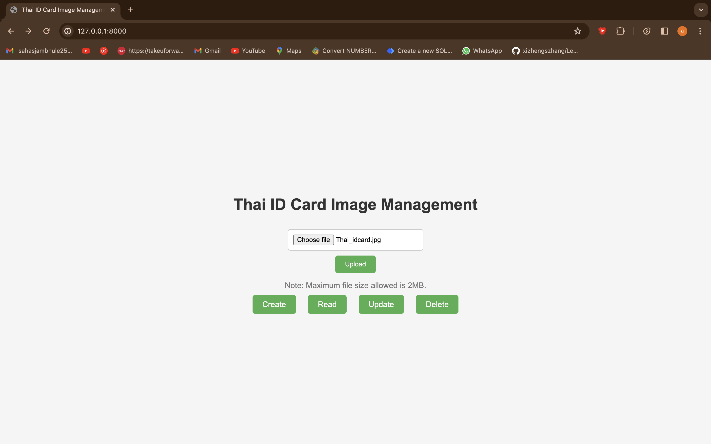

# Thai_National_idcard_Text_Detection

Welcome to the project! This project demonstrates a chain of functionality where Data Extraction from Thai Id card, Data Cleaning and storing it to database followed bt CRUD operations

<h2>Table of Contents</h2>
    <ul>
        <li><a href="#architecture">Architecture</a></li>
        <li><a href="#features">Features</a></li>
        <li><a href="#technologies">Technologies</a></li>
        <li><a href="#working">Working</a></li>
        <li><a href="#getting-started">Getting Started</a></li>
        <li><a href="#output">Output</a></li>
    </ul>
<h2 id="architecture">Architecture</h2>
<h3>2D Architecture Diagram</h3>

This diagram involves the basic architecture of application

  <strong>Frontend (Client):</strong>

<ul>
 <li>User Interface (UI): Responsible for rendering the user interface and handling user interactions.</li>
 <li> Upload Image for OCR: Here image is uploaded to read data directly from Thai ID card image
 </li>
 <li> CRUD operations: These operation involves the data management in database
 </li>
</ul>

 <strong>Backend (Server):</strong>

    <ul>
        <li>API Endpoints: Offers various API endpoints for frontend communication, including image reading using Google vision, data updatation, data deletion and 
            data retrieval.</li>
        <li>OCR Image reading: Implementing Image reading using Google vision API  and extract data</li>
        <li>Data Cleaning: This involves Data cleaning from extracted data       </li>
        <li>Database (SQLite): Utilizes SQLite for data storage and associated operations.</li>
    </ul>

<h2 id="#features">Features</h2>
    <ul>
        <li>OCR Image reading</li>
        <li>GUI which enables to perform CRUD operations</li>
    </ul>

<h2 id="#technologies">Technologies</h2>

        <strong>Frontend:</strong>

<ul>
        <li>HTML, CSS</li>
        <li>Bootstrap</li>
</ul>

        <strong>Backend:</strong>

    <ul>
        <li>FAST API</li>
        <li>Python (Data Cleaning)</li>
        <li>Google Vision</li>
    </ul>

        <strong>Databases:</strong>

    <ul>
        <li>SQLite</li>
    </ul>
<h2 id="working">Working</h2>
<ul>
    <li>Data Preprocessing:
 Convert image to grascale for noice reduction
</li>  
    <li>Data Reading from Image:
 Extract Data from Image using API
</li> 
    <li>Data Cleaning:
 Cleaning of data after extraction
</li> 
    <li>Data Extraction:
 Extraction of relevent data after cleaning
</li> 
</ul>
<h2 id="#getting-started">Getting Started</h2>
    <ol>
        <li>Get to following link for starting project locally 
            <pre>https://github.com/yourusername/Thai_National_idcard_Text_Detection
</pre>
        </li>
      <li> Download the zip and extrat it</li>
        <li>Install dependencies for  backend:
<pre>pip install database fastapi starlette starlette Database fastapi JSONResponse FastAPI File UploadFile HTTPException StaticFiles Request Jinja2Templates</pre>
        </li>
        <li>Start the frontend : Open index.html in templates folder
        <pre># In the project directory
     uvicorn main:app --reload</pre>
        </li>
            <li>Access the application's Frontend at <a href="http://localhost:3001">by opening index.html file</a> in your web browser.
        <li>Access the application's Bakend at <a href="http://localhost:5000">http://localhost:8000</a> in your web browser.
        
</li>
</ol>
<h2 id="output">Output</h2>
<ul>
    <li>
Main Web page
</li>   
    <li>
Read operation Web page 
</li>  
    <li>
Create operation Web page
</li>  
    <li>
Delete operation Web page
</li>  
    <li>
Update operation Web page
</li>  
</ul>

